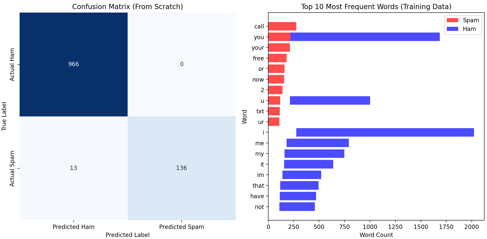
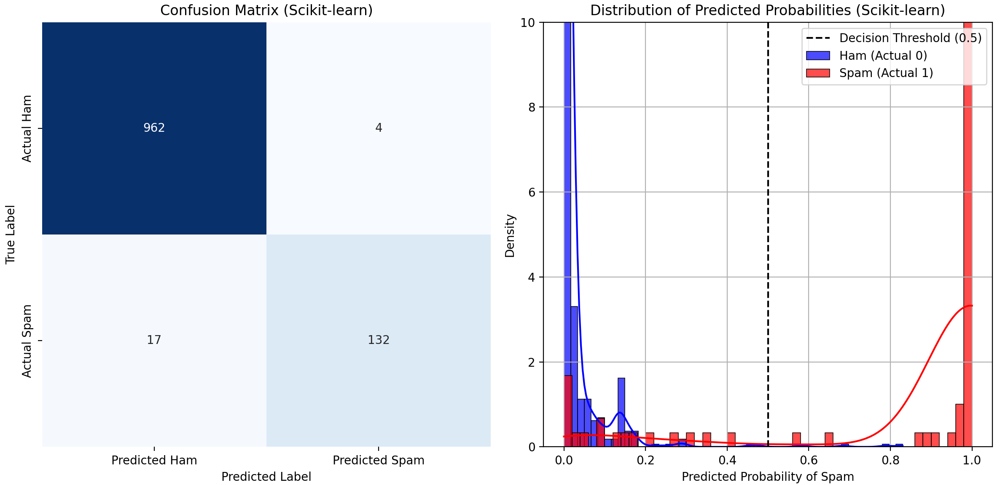

# **Naive Bayes on SMS Spam Collection Dataset**

This repository contains two Python scripts demonstrating **Naive Bayes Classification** on the **SMS Spam Collection dataset**: one implemented **from scratch**, and the other using the `scikit-learn` library.

## **Problem Statement**

The primary goal of this project is to **classify SMS messages** as either "**spam**" or "**ham**" (not spam). By building and evaluating Naive Bayes models, I aim to identify unwanted messages, providing a fundamental example of **text classification**. I compare a **custom-built Naive Bayes model** with a **library implementation**.

## **Results**

### 1. **Naive Bayes From Scratch (Using Gradient Descent)**

The Python script for this implementation is located at `naive_bayes_classifier_scratch.py`. Below are the plots showing the model's performance.

* **Accuracy:** `0.9883`

* **Precision:** `1.0000`

* **Recall:** `0.9128`

* **F1 Score:** `0.9544`

**Confusion Matrix (From Scratch):**

[[966   0]

[ 13 136]]

* `True Negatives (Ham)`: `966`

* `False Positives (Spam)`: `0`

* `False Negatives (Ham)`: `13`

* `True Positives (Spam)`: `136`

### 2. **Naive Bayes with Scikit-learn**

The Python script for this implementation is located at `naive_bayes_classifier_sklearn.py`. Below are the plots showing the Confusion Matrix and the Distribution of Predicted Probabilities.

* **Accuracy:** `0.9812`

* **Precision:** `0.9706`

* **Recall:** `0.8859`

* **F1 Score:** `0.9263`

**Confusion Matrix (Scikit-learn):**

[[962   4]

[ 17 132]]

* `True Negatives (Ham)`: `962`

* `False Positives (Spam)`: `4`

* `False Negatives (Ham)`: `17`

* `True Positives (Spam)`: `132`

## **Conclusion**

Both implementations achieved **excellent results** for SMS spam detection, demonstrating the effectiveness of the **Naive Bayes algorithm** for text classification. The **"from scratch" model** showed slightly higher performance in this specific run, particularly in precision, indicating **zero false positives**. 